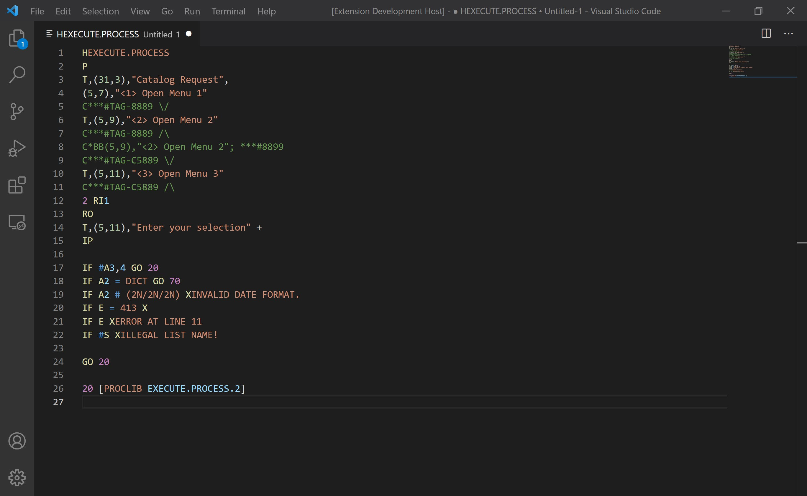

# mvbase-proc-extension

## Syntax Highlighter

The syntax highlighter is the main feature of the VSCode mvBase Proc Extension. It provides developers who use the language a better way to update existing programs or develop new programs in the mvBase PROC language.

### Features

The mvBase PROC Extension will highlight the following:
* Commands (A, H, RO, IF, STOFF, etc.)
* Command Parameters
* Labels
* Unquoted and Quoted Strings
* Comments
* Numeric Digits
* PROC Identifier (PQ)

### Demo

Here is a small snippet of what the syntax highlighter currently looks like.

  

### Use

The mvBase PROC Syntax Highlighter can be activated in two ways:

1. Changing the file extension to `.proc`. VSCode will automatically recognize that a file needs to be interpreted by the mvBase Proc Syntax Highlighter if it has a `.proc` file extension.
2. Use the Command Palette (Ctrl+Shift+P) to select **Change Language Mode**. From there you can select mvBase PROC as the language for the file.

### Notes

The theme works best with Monakai Dimmed or Dark+.

### Coming Soon

* Code Snippets with detailed documentation!
* PROC User Exits

Please raise any existing issues with this extension through [GitHub](https://github.com/tcharts-boop/mvbase-proc-extension/issues).
